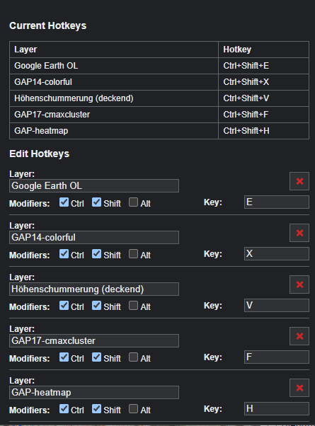

## Info

Chrome Extension for BRouter-Web (created through AI assisted coding) that allows setting a custom keyboard Shortcut for a specified named custom layer.

## Configuration and backups

Layer names and shortcuts are stored in Chrome's synced extension storage, rather than in a file in this repository. Use **Export Backup** in the extension popup to download the current configuration as a timestamped JSON file, and **Import Backup** to restore it on this or another browser profile. You can keep downloaded backups in `backup/`; that folder and backup filenames are intentionally ignored by Git so personal layer names and shortcuts are never committed.

## Changelog

See [releases](https://github.com/momentmal/BRouter-Web-ToggleCustomLayerHotKey/releases)

## Screenshot

